# Pachira Budget App

## Overview
Pachira Budget App is a comprehensive Android application designed to help users manage their personal finances effectively. The app allows users to track income and expenses, categorise transactions, set budget limits, and visualise spending patterns.

## Group Members
- Akhilesh Parshotam
- Erin Chisholm
- Connor Tre Van Buuren
- Ethan Ruey Huntley

## Features

### User Authentication
- Secure login and registration using Firebase Authentication
- Password recovery functionality
- User profile management

### Dashboard
- Overview of financial status
- Income and expense summaries
- Category-based spending analysis with progress bars
- Quick access to recent transactions

### Transaction Management
- Add income and expense transactions
- Categorise transactions
- Add descriptions and dates
- View transaction history
- Filter transactions by date range

### Category Management
- Create custom categories for both income and expenses
- Assign colors and icons to categories
- Set budget limits for expense categories
- Edit and delete existing categories
- Default categories provided for quick setup

### Budget Tracking
- Set spending limits for expense categories
- Visual progress bars showing budget usage
- Alerts when approaching or exceeding budget limits

### Data Visualisation
- Monthly income and expense summaries
- Category-based spending analysis
- Progress tracking against budget limits

## Screenshots

### Onboarding & Authentication
<div style="display: flex; flex-direction: row; flex-wrap: wrap;">
  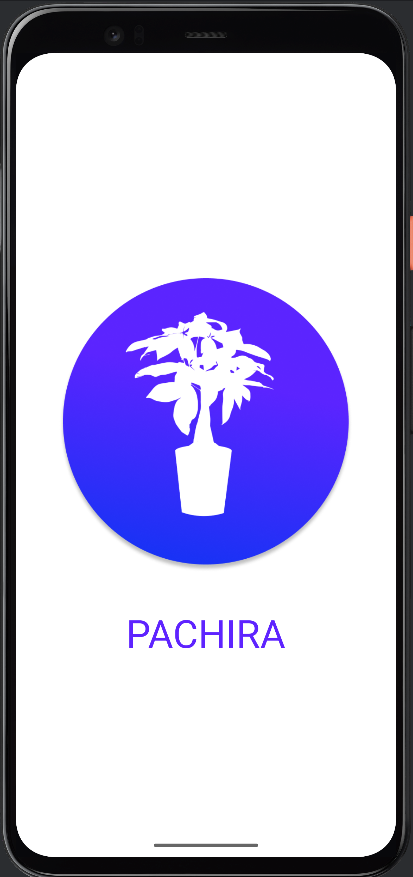
  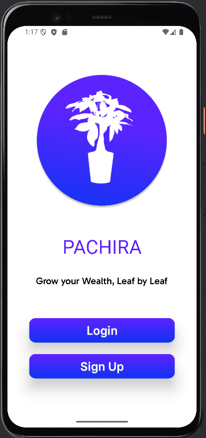
  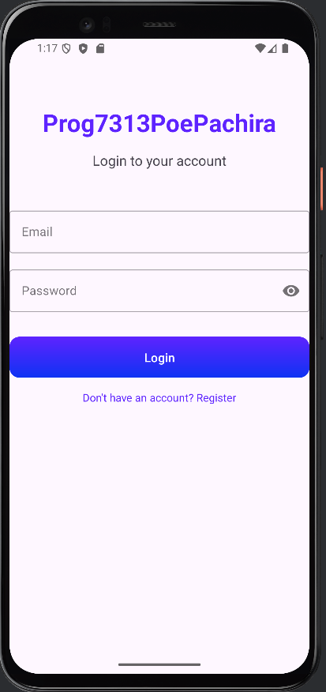
  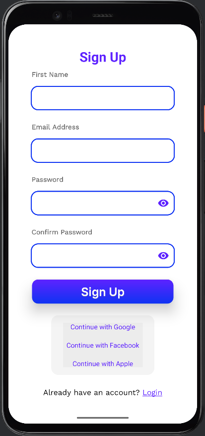
</div>

### Main Functionality
<div style="display: flex; flex-direction: row; flex-wrap: wrap;">
  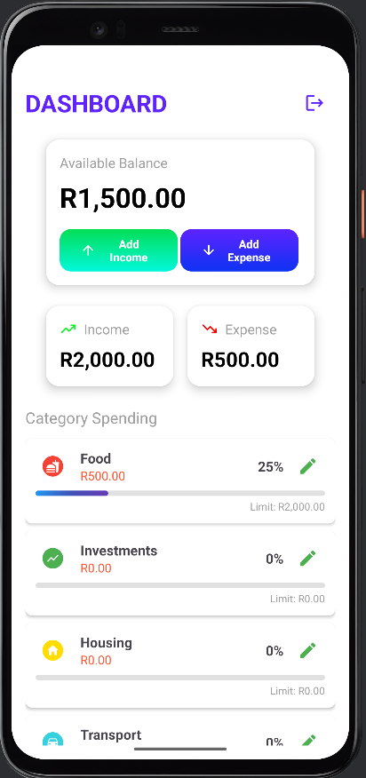
  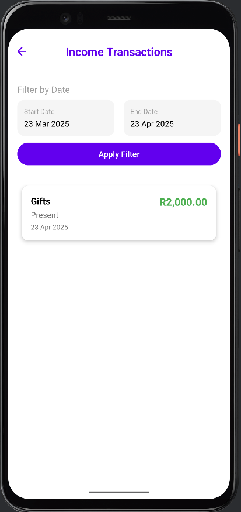
  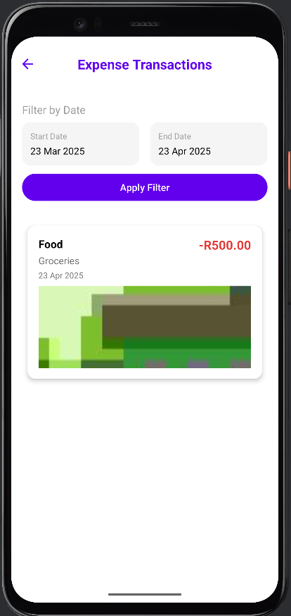
</div>

### Adding Transactions
<div style="display: flex; flex-direction: row; flex-wrap: wrap;">
  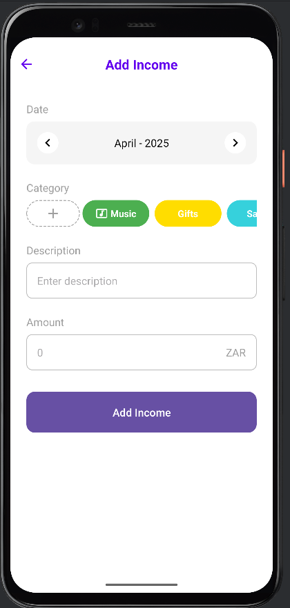
  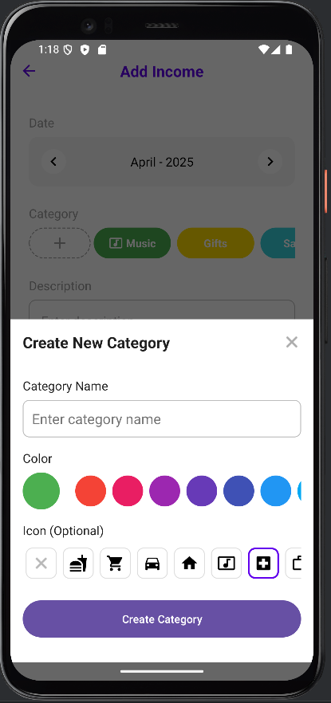
  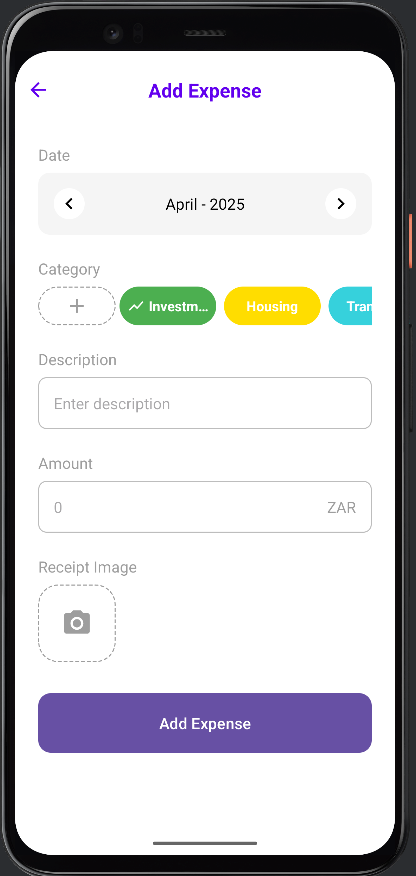
  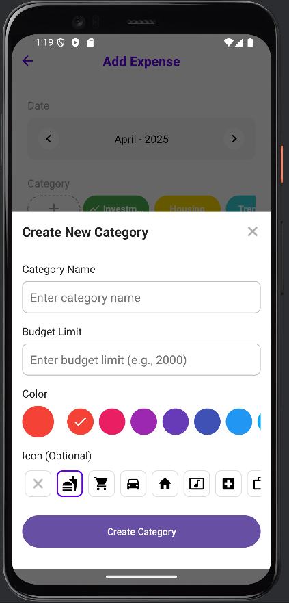
</div>

### Category Management
<div style="display: flex; flex-direction: row; flex-wrap: wrap;">
  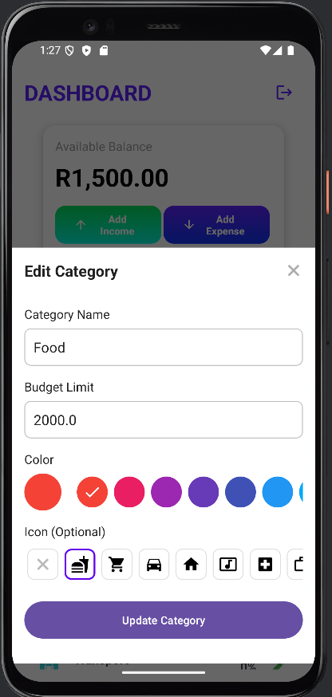
</div>

## Technologies Used

- **Language**: Kotlin
- **Platform**: Android
- **Database**: Firebase Realtime Database
- **Authentication**: Firebase Authentication
- **UI Components**: Material Design, RecyclerView, BottomSheetDialog
- **Architecture**: Activity-based with Firebase integration

## Setup Instructions

### Prerequisites
- Android Studio Arctic Fox (2020.3.1) or newer
- JDK 11 or newer
- Android SDK 30 or newer
- Firebase account

### Installation
1. Clone the repository
2. Open the project in Android Studio
3. Create a Firebase project and add the `google-services.json` file to the app directory
4. Configure Firebase Authentication and Realtime Database in the Firebase console
5. Build and run the application on an emulator or physical device

## Usage Instructions

### First-time Setup
1. Register a new account or log in with existing credentials
2. The app will automatically create default income and expense categories
3. Navigate to the dashboard to see an overview of your finances

### Adding Transactions
1. From the dashboard, tap the "+" button to add a new transaction
2. Select whether it's an income or expense
3. Choose a category, enter the amount, add a description, and select a date
4. Tap "Save" to record the transaction

### Managing Categories
1. When adding a transaction, tap the "+" button next to categories
2. Enter a name for the category
3. Select a color and icon
4. For expense categories, set a budget limit if desired
5. Tap "Create Category" to save

### Viewing Transactions
1. From the dashboard, tap on the income or expense card
2. Use the date filter to select a specific period
3. View transactions grouped by category with progress bars for expenses

## Future Improvements

- Dark mode support
- Export financial data to CSV/PDF
- Recurring transactions
- Financial goals setting and tracking
- Multi-currency support
- Cloud backup and sync across devices
- Widgets for quick transaction entry
- Biometric authentication
- Advanced analytics and reporting
- Bill reminders and notifications

## Credits

- Icons: Material Design Icons
- Color schemes: Material Design Color System
- Firebase integration: Google Firebase Documentation

---

Developed by Akhilesh Parshotam, Erin Chisholm, Connor Tre Van Buuren, and Ethan Ruey Huntley
```
